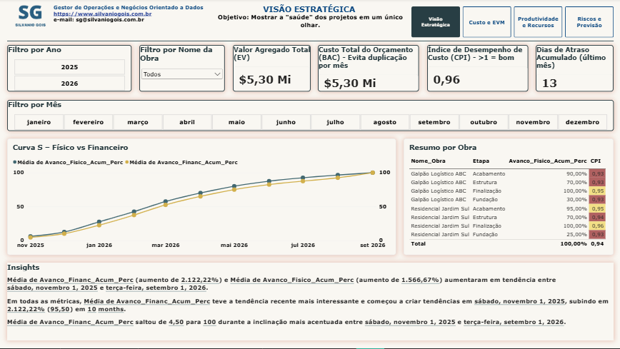
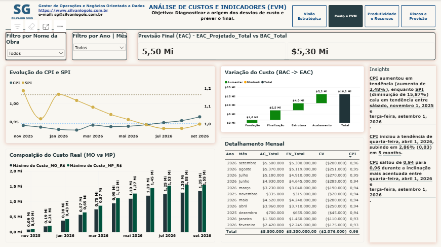
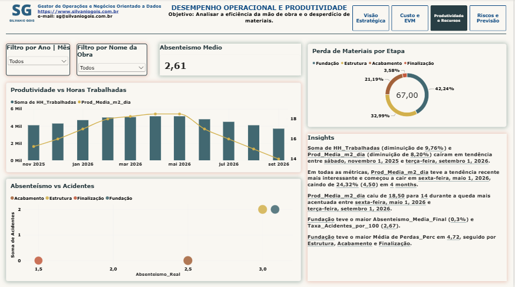
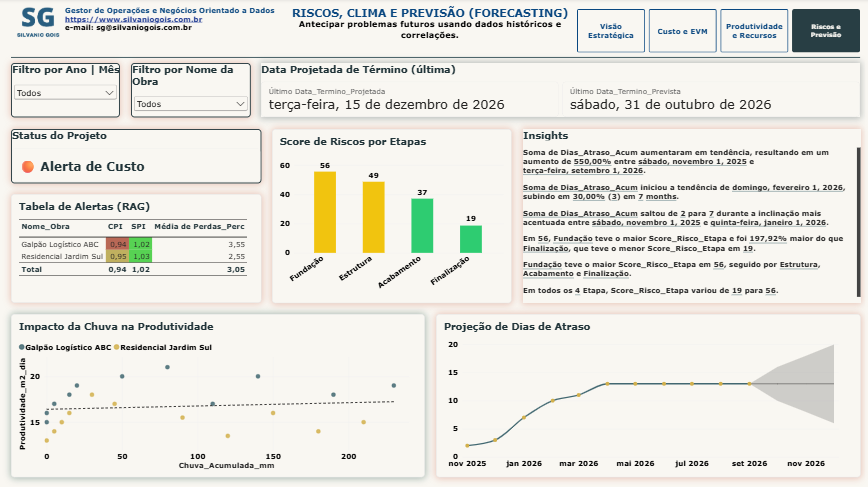

#  Painel Integrado de Planejamento e Controle de Obras

**Dashboard executivo para gestão de obras com foco em Earned Value Management (EVM), produtividade, riscos e previsões.**

---

##  Sobre o Projeto

Este projeto consiste em um **dashboard interativo desenvolvido no Microsoft Power BI** para o planejamento e controle de obras da construção civil. O relatório foi estruturado em **4 páginas** que cobrem desde a visão estratégica até a análise de riscos e previsões, utilizando a metodologia **Earned Value Management (EVM)** e indicadores operacionais.

O dashboard permite aos gestores:
- Acompanhar a **saúde financeira e física** dos projetos em tempo real.
- Diagnosticar **desvios de custo e prazo** com base em métricas consolidadas.
- Analisar a **produtividade da mão de obra** e o **desperdício de materiais**.
- Antecipar **riscos futuros** com base em dados históricos e correlações.

---

##  Autor

**Silvanio Gois**  
Gestor de Operações e Negócios Orientado a Dados

---

##  Visualização do Dashboard

### Página 1 – Visão Estratégica
*Objetivo: Mostrar a "saúde" dos projetos em um único olhar.*

**Indicadores-chave:**
- **BAC (Orçamento Total):** R$ 5,30 Mi
- **EV (Valor Agregado):** R$ 5,30 Mi
- **CPI (Índice de Desempenho de Custo):** 0,96
- **Dias de Atraso Acumulado:** 13 dias

**Curva S – Físico vs Financeiro:** A curva evolui de forma consistente, com o avanço financeiro ligeiramente à frente do físico nos primeiros meses, estabilizando-se em 100% ao final do período.

**Resumo por Obra:** A matriz apresenta o avanço físico acumulado por etapa e o CPI de cada obra, permitindo comparar o desempenho entre os projetos.

---

### Página 2 – Análise de Custos e Indicadores (EVM)
*Objetivo: Diagnosticar a origem dos desvios de custo e prever o final.*

**Previsão Final (EAC):** R$ 5,50 Mi (vs. BAC de R$ 5,30 Mi)

**Evolução do CPI e SPI:**
- O **CPI** apresentou tendência de alta nos últimos meses (aumento de 2,48%), indicando melhora na eficiência de custos.
- O **SPI** manteve-se próximo de 1,0, demonstrando que o prazo está sob controle.

**Composição do Custo Real (MO vs MP):** O gráfico de barras empilhadas mostra a evolução dos custos de mão de obra e materiais ao longo do tempo, permitindo identificar onde os desvios estão ocorrendo.

**Variação do Custo (BAC → EAC):** O gráfico de cascata detalha como cada etapa contribuiu para a variação do custo total, com destaque para a etapa de **Estrutura** como a maior responsável pelo estouro.

**Detalhamento Mensal:** Tabela com AC, EV, CV e CPI por mês, consolidando a análise EVM.

---

### Página 3 – Desempenho Operacional e Produtividade
*Objetivo: Analisar a eficiência da mão de obra e o desperdício de materiais.*

**Produtividade vs Horas Trabalhadas:** A produtividade (m²/dia) e as horas trabalhadas apresentaram tendência de queda ao longo do período, indicando possível perda de eficiência.

**Absenteísmo vs Acidentes:** O gráfico de dispersão relaciona a taxa de absenteísmo com a ocorrência de acidentes, sugerindo uma correlação positiva entre as variáveis.

**Perda de Materiais por Etapa:** O gráfico de rosca evidencia que as maiores perdas ocorrem nas etapas iniciais (Fundação e Estrutura), com destaque para a Fundação (42,24%).

**Absenteísmo Médio:** 2,61% – indicador dentro da média esperada para o setor.

---

### Página 4 – Riscos, Clima e Previsão (Forecasting)
*Objetivo: Antecipar problemas futuros usando dados históricos e correlações.*

**Datas de Término:**
- **Prevista:** 31/10/2026
- **Projetada:** 15/12/2026 (atraso estimado de 45 dias)

**Status do Projeto:** "Alerta de Custo" – coerente com o CPI de 0,96.

**Tabela de Alertas (RAG):** Classificação dos projetos por CPI, SPI e Perda de Materiais, com sinalização de riscos.

**Score de Riscos por Etapas:** A **Fundação** apresenta o maior score de risco (56), enquanto a **Finalização** tem o menor (19), indicando que os riscos se concentram nas fases iniciais da obra.

**Impacto da Chuva na Produtividade:** O gráfico de dispersão mostra a correlação entre a chuva acumulada e a produtividade, evidenciando que em meses com maior precipitação a produtividade tende a cair.

**Projeção de Dias de Atraso:** O gráfico de linhas com previsão estatística (suavização exponencial) projeta a continuidade da tendência de atraso, reforçando a necessidade de ações corretivas.

---

##  Principais Insights

1. **Eficiência de Custo:** O CPI de 0,96 indica que os projetos estão custando aproximadamente 4% a mais do que o valor agregado, caracterizando um "Alerta de Custo" que demanda acompanhamento.

2. **Prazo sob Controle:** O SPI próximo de 1,0 demonstra que, apesar do atraso acumulado de 13 dias, o desempenho de prazo está dentro do esperado.

3. **Riscos Concentrados nas Fases Iniciais:** A Fundação e a Estrutura concentram os maiores índices de perda de materiais e riscos, sugerindo que a gestão deve ser mais rigorosa nessas etapas.

4. **Produtividade em Queda:** A redução da produtividade ao longo do tempo pode estar associada ao aumento do absenteísmo e à ocorrência de acidentes, indicando a necessidade de revisão dos processos operacionais.

5. **Correlação Chuva vs Produtividade:** Meses com alta pluviosidade impactam negativamente a produtividade, reforçando a importância do planejamento climático.

---

## 🛠️ Técnicas Utilizadas

| Técnica | Descrição |
| :--- | :--- |
| **Earned Value Management (EVM)** | Utilização das métricas BAC, EV, AC, CPI, SPI, CV e SV para controle de custos e prazos. |
| **Curva S** | Acompanhamento da evolução física e financeira ao longo do tempo. |
| **Análise de Variância (Cascata)** | Decomposição da variação do custo por etapa do projeto. |
| **Normalização de Indicadores** | Padronização de métricas como Perda de Materiais, Absenteísmo e CPI para cálculo do Score de Risco. |
| **Forecasting (Suavização Exponencial)** | Projeção de tendências futuras para Dias de Atraso e Produtividade. |
| **Análise de Correlação** | Relação entre variáveis como Absenteísmo vs Acidentes e Chuva vs Produtividade. |
| **Formatação Condicional (RAG)** | Sinalização visual (Vermelho, Amarelo, Verde) para alertas de desempenho. |

---

##  Arquivos do Projeto

| Arquivo | Descrição |
| :--- | :--- |
| `Obras.xlsx` | Base de dados consolidada com informações mensais das obras (custo, avanço físico, produtividade, etc.). |
| `logo_br_site.png` | Logo usado no projeto. |
| `PlanejamentoDeObrasSenior.pbix` | Arquivo fonte do dashboard no Power BI. |
| `PlanejamentoDeObrasSenior.pdf` | Exportação em PDF do relatório completo. |
| `pagina1.png` | Captura de tela da Página 1 – Visão Estratégica. |
| `pagina2.png` | Captura de tela da Página 2 – Análise de Custos e EVM. |
| `pagina3.png` | Captura de tela da Página 3 – Desempenho Operacional. |
| `pagina4.png` | Captura de tela da Página 4 – Riscos e Previsão. |
| `README.md` | Este arquivo de documentação. |

---

##  Acesso ao Dashboard Online

O relatório está disponível publicamente no Power BI Service:

[**Acesse o Dashboard Online**](https://app.powerbi.com/view?r=eyJrIjoiZTEwZTE2NDEtZGE4ZS00MDg1LWFiZTYtMDNiZjM4MDFhY2E3IiwidCI6IjJlYmQyYzU0LWY1ZDMtNGVmYi05ZGE3LWU4Yzk0YmQyMWQzOSJ9)

---

##  Contato

Para dúvidas, sugestões ou oportunidades de colaboração:

- **E-mail:** sg@silvaniogois.com.br
- **LinkedIn:** [Silvanio Gois](https://www.linkedin.com/in/silvanio-gois/)
- **GitHub:** [SilvanioSG](https://github.com/SilvanioSG)
- **Site:** [silvaniogois.com.br](https://www.silvaniogois.com.br/)

---

##  Licença

Este projeto é de uso pessoal e educacional. Fique à vontade para utilizá-lo como referência para seus próprios dashboards.

---

**Última atualização:** Setembro de 2026
